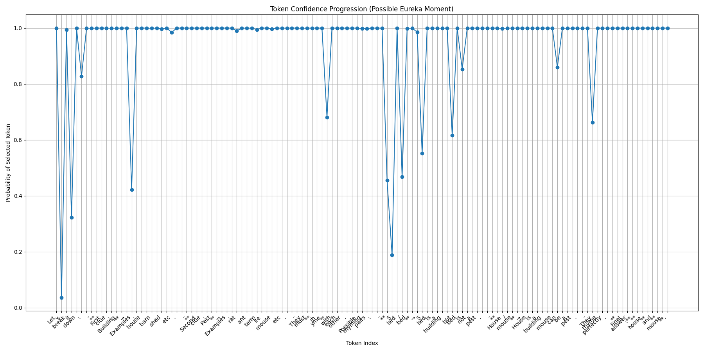
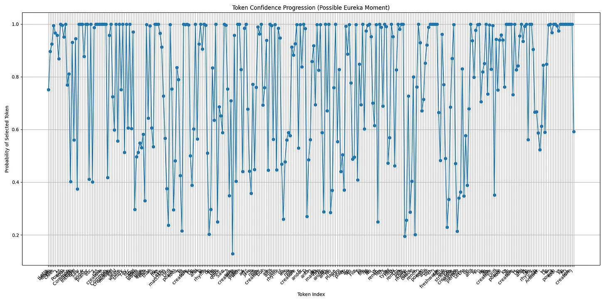
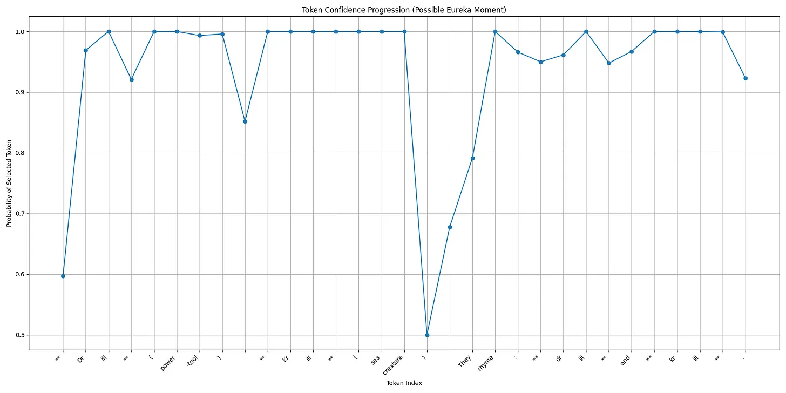

# Understanding Aha Moments in LLMs


Discovery (often) involves speculatively generating a set of models that might explain our observations, and then testing those models (either in our head or explicitly in real life) until we find one that properly explains the observations.

A trivial example:
```
You’re playing a word puzzle in a competition. I give you two clues: Furniture, Follicle. 
You must guess two rhyming words, one related to each clue.
What are the rhyming words?
```
You brain basically goes through this search of “could it be “Table and…” until it lands on the correct answer and has a little “Aha!” moment where it instantly knows it’s got it. 

The above answer is obviously ridiculous, but the fundamental principle is the same for much more complex things like discovering new scientific principles. 

Things that we find “Interesting” are things that help us update our explanatory model. This is distinct from “information”.

For example:

I tell you I’m thinking of four random letters. If I tell you the last letter is “Q”, that’s information, but not interesting. 

I tell you that I’m thinking of a four letter word. Now if I tell you the last letter is “Q”, that’s more interesting because it allows you to create an explanatory model of what the other letters might be.

This generalises across a whole bunch of domains, including gossip. "I knew person XYZ was a selfish person, and this story you just told me confirms it”

Things that are maximally interesting are things that help us update our big curly explanatory models, like the Grand Unified Theory.

If we can find a way to wire LLM’s to naturally search for interesting things, then we’re getting closer to an AGI in the “curious robot” sense.

One of the first steps in this is to work out whether can measure whether an LLMs has had an “Aha” moment, as this can be a reward signal; we want LLMs to want to have Aha moments.

Hypothesis: Aha moments are accompanied with a drop in uncertainty, because you can go back and confirm your observations. We should see an equal drop in the uncertainty in the next predicted token.

Here’s the next token certainty of an LLM for a word pair challenge (Building, Pest > House, Mouse) where the model just gets the answer right away



As you can see the confidence remains high the whole way through, so there hasn’t been an “aha” moment. 

Here’s one for one that the model finds more tricky, (Power tool, Small Sea Animal > Drill, Krill)



As you can see, the model has much more varied confidences as it tries different combinations “Let’s See, “Drill” and “Eel”?  Not Quite”, right up until the very last moment where it locks in on the correct answers, confirm they rhyme and the confidences go high. 

Ok lets try something different - let’s just ask it to generate text that’s non trivial, but doesn’t involve any “aha” moments. “Explain special relatively in simple terms”.


It has the same varied confidences the whole way through which is kind of surprising - I would have instinctively thought that given the model is confident in the answer, the probabilities would reflect that. But I guess the distinction here is the model knows what general relativity is, but it doesn’t know what words it’s going to choose to explain it. This poses a problem though, because it’s very hard to tell the difference between this trace and the “aha” moment trace. 

Ok so let’s evolve the idea - if a model has an “aha” moment, when it re-visits the problem it should be much more confident the second time round. Here we have a test where:

1. I tell the model I’m going to ask it a bunch of rhyming word problems

2. I ask the model the “Power Tool, Sea Creature” problem

3. I ask the model a distractor question “Pest, Building” etc

4. I ask the model “Power Tool, Sea Creature” again.

Here’s the second round ask of “Power Tool, Sea Creature”



As you can see, the confidence in the response is wildly different!

This is kind of cool. So it seems like we have a really strong signal for when a model has had an “Aha” moment, as supposed to standard uncertainty from regular text generation.

The problem here is that there’s no way to distinguish between a trivial “aha” moment (Drill/Krill) and a profound “aha” moment (solving the Grand Unified Theory). We don’t want a model that just gets addicted to word games.

Hypothesis: More profound Aha moments will have different changes is the activations inside the NN compared to simple ones. Linear Probes might be useful here... 
